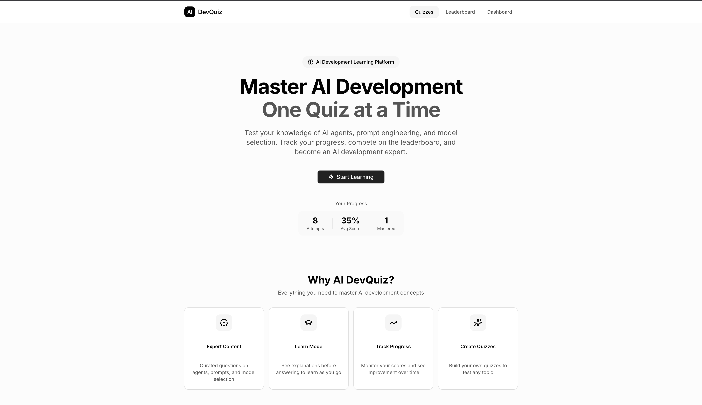
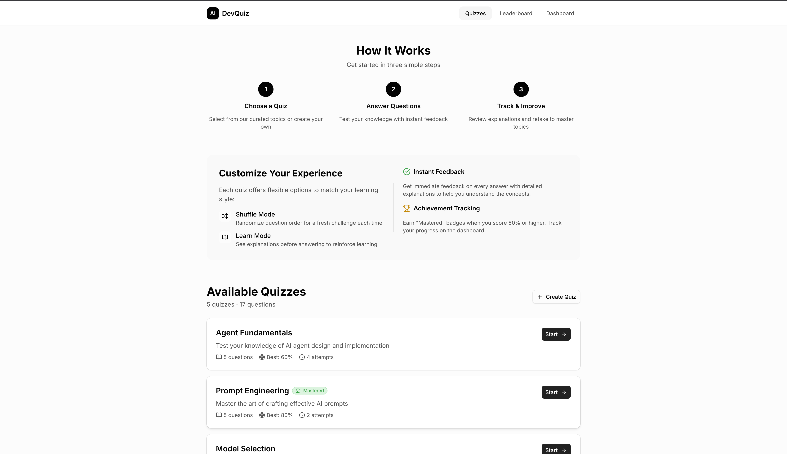
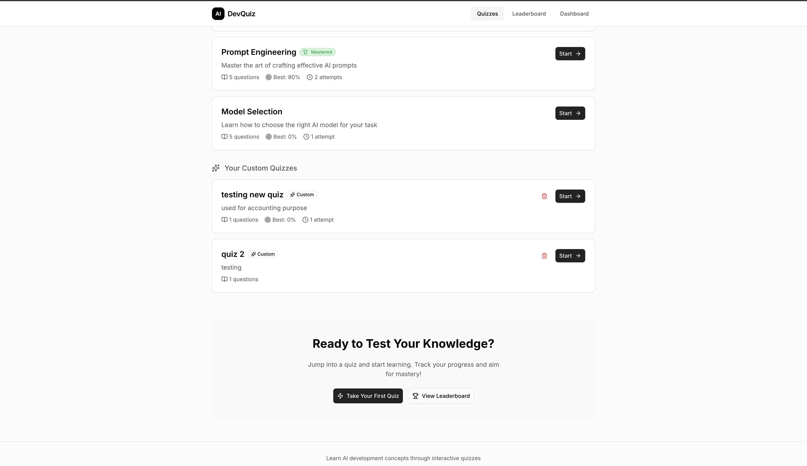
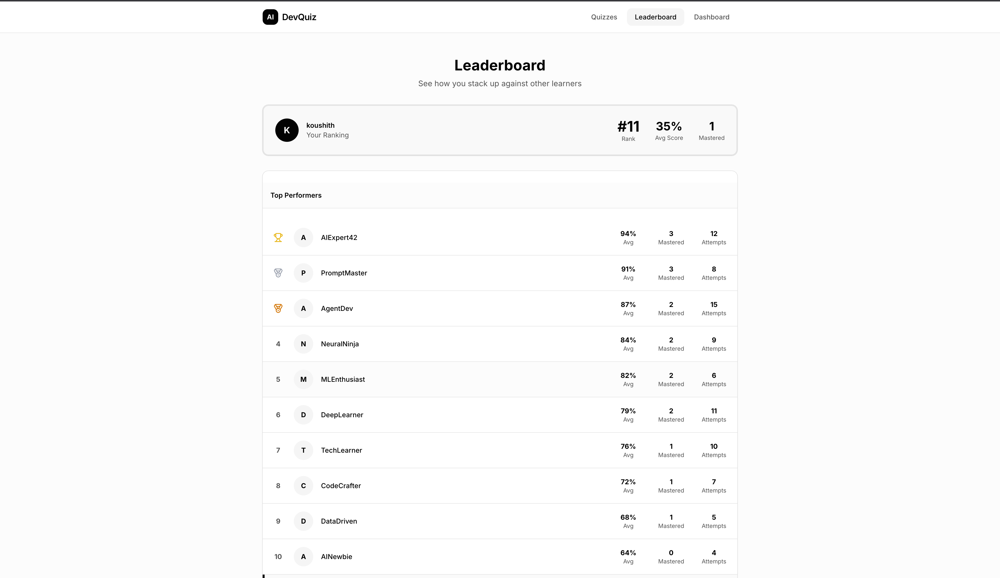
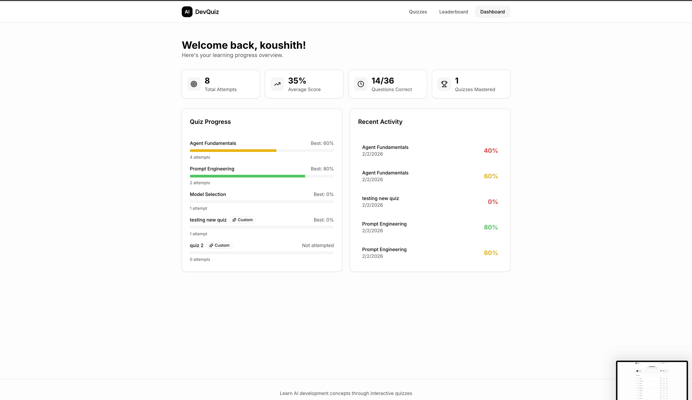
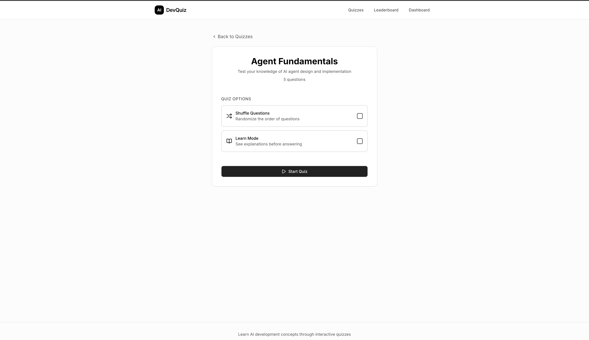
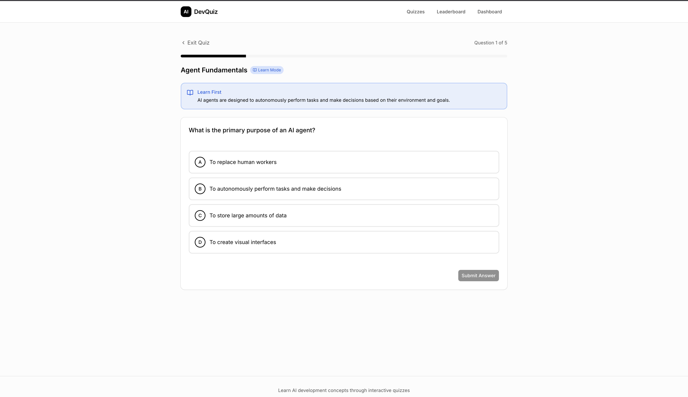
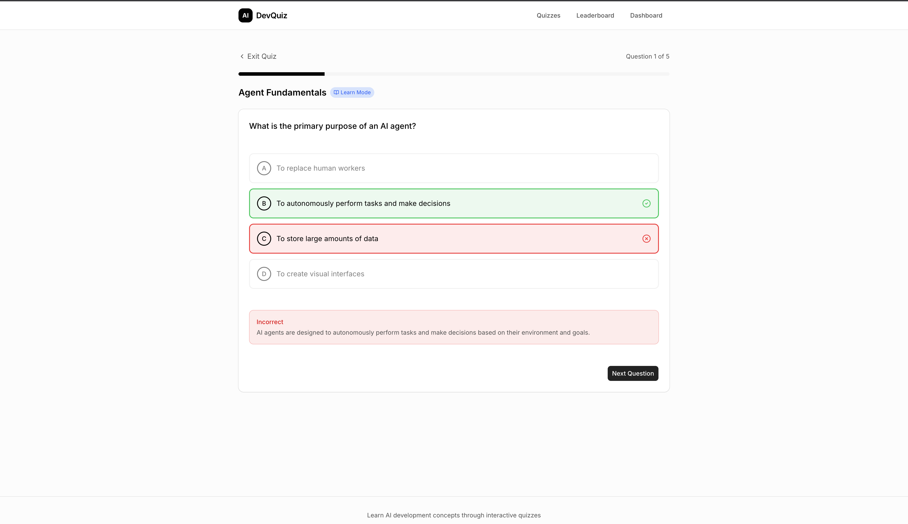

# AI Development Quiz App

An educational quiz platform designed to help users test and reinforce their understanding of AI software development concepts including agent design, prompt engineering, and model selection.

## Screenshots

### Home Page (Hero)


### Home Page (How It Works & Quizzes)


### Home Page (Custom Quizzes)


### Leaderboard


### Dashboard


### Quiz Start


### Quiz Question (Learn Mode)


### Quiz Answer Feedback


## Features

### Core Functionality
- **Multiple Quiz Categories** - Agent Fundamentals, Prompt Engineering, Model Selection
- **Interactive Quiz Experience** - Multiple choice questions with immediate feedback
- **Progress Tracking** - Visual progress bar and question counter
- **Detailed Explanations** - Learn why answers are correct after each question
- **Results & Scoring** - Percentage scores with performance feedback
- **Answer Review** - Review incorrect answers with explanations

### User Engagement
- **User Profiles** - Optional username for personalized experience
- **Dashboard** - Track attempts, average scores, and quiz history
- **Leaderboard** - Compete with simulated users and track your rank
- **Persistence** - All progress saved to localStorage
- **Mastery Badges** - Earn "Mastered" status when scoring 80%+

### Learning Modes
- **Quiz Mode** - Standard quiz with scoring (counts towards stats)
- **Learn Mode** - See explanations before answering to reinforce learning
- **Shuffle Mode** - Randomize question order for a fresh challenge each time

### Custom Quiz Creation
- **Build Your Own Quizzes** - Create custom quizzes on any topic
- **Flexible Questions** - Add unlimited questions with 2-4 options each
- **Full Validation** - Input validation with character limits
- **Manage Quizzes** - Delete custom quizzes when no longer needed

## Tech Stack

- **React 19** - UI framework
- **TypeScript** - Type safety
- **Vite** - Build tool
- **Tailwind CSS 4** - Styling
- **shadcn/ui** - UI components
- **React Router** - Navigation
- **localStorage** - Data persistence

## Getting Started

### Prerequisites
- Node.js 20.19+ or 22.12+
- npm

### Installation

```bash
# Install dependencies
npm install

# Start development server
npm run dev

# Build for production
npm run build

# Preview production build
npm run preview
```

## Project Structure

```
src/
├── components/
│   ├── ui/              # shadcn/ui components (Button, Card, Input, Badge)
│   ├── Layout.tsx       # App layout with navigation
│   ├── QuizCard.tsx     # Quiz listing card component
│   ├── FeatureCard.tsx  # Feature highlight card
│   ├── StatCard.tsx     # Statistics display card
│   └── ConfirmDialog.tsx # Reusable confirmation dialog
├── data/
│   ├── quizzes.ts       # Quiz content (easily expandable)
│   └── mockLeaderboard.ts # Simulated leaderboard users
├── lib/
│   ├── utils.ts         # Utility functions
│   └── validation.ts    # Runtime validation & input sanitization
├── pages/
│   ├── Home.tsx         # Landing page & quiz selection
│   ├── Quiz.tsx         # Quiz experience with modes
│   ├── Results.tsx      # Score & answer review
│   ├── Dashboard.tsx    # User progress & statistics
│   ├── Leaderboard.tsx  # Rankings & competition
│   └── CreateQuiz.tsx   # Custom quiz builder
├── services/
│   └── storage.ts       # localStorage utilities with validation
├── types/
│   └── index.ts         # TypeScript interfaces
├── App.tsx              # Routes
└── main.tsx             # Entry point
```

## Adding New Quizzes

### Via Code
Edit `src/data/quizzes.ts`:

```typescript
{
  id: 'your-quiz-id',
  title: 'Your Quiz Title',
  description: 'Quiz description',
  questions: [
    {
      id: 1,
      question: 'Your question?',
      options: ['Option A', 'Option B', 'Option C', 'Option D'],
      correctAnswer: 0, // Index of correct option
      explanation: 'Explanation of the correct answer'
    },
    // Add more questions...
  ]
}
```

### Via UI
Use the "Create Quiz" feature in the app to build custom quizzes without code changes.

## User Flow

1. User arrives at home page and sees available quizzes with progress stats
2. User selects a quiz and configures Shuffle/Learn Mode options
3. Questions are presented one at a time with progress indicator
4. After answering, feedback and explanation are shown immediately
5. Results page displays score with performance message
6. User can review all answers or retake the quiz
7. Dashboard shows complete history and statistics
8. Leaderboard displays user ranking among other participants

## Security Features

- **Runtime Validation** - All localStorage data is validated before use
- **Input Sanitization** - User inputs are trimmed and length-limited
- **Secure IDs** - Custom quizzes use `crypto.randomUUID()` for unique IDs
- **Input Limits** - Character limits on all form fields prevent abuse

## Future Scope & Improvements

### Backend Integration
- **Database Integration** - Replace localStorage with PostgreSQL/MongoDB for persistent storage
- **User Authentication** - Add login/signup with OAuth (Google, GitHub) or email/password
- **API Development** - RESTful or GraphQL API for quiz management
- **Real Leaderboard** - Server-side leaderboard with actual user rankings

### Enhanced Features
- **Timed Quizzes** - Add countdown timer for competitive quiz modes
- **Daily/Weekly Challenges** - Scheduled quizzes with special rewards
- **Quiz Categories & Tags** - Better organization with filtering and search
- **Difficulty Levels** - Easy, Medium, Hard modes for each quiz
- **Streaks & Achievements** - Gamification with badges and daily streaks
- **Social Sharing** - Share results on social media platforms

### Content & Learning
- **AI-Generated Questions** - Use LLMs to generate quiz questions from topics
- **Import/Export Quizzes** - JSON/CSV import and export functionality
- **Quiz Templates** - Pre-built templates for common quiz formats
- **Spaced Repetition** - Smart review system for questions answered incorrectly
- **Progress Analytics** - Detailed charts showing learning trends over time

### User Experience
- **Dark/Light Theme Toggle** - User preference for color scheme
- **Mobile App** - React Native version for iOS/Android
- **Offline Support** - PWA with service workers for offline access
- **Accessibility Improvements** - Enhanced screen reader support, keyboard navigation
- **Multi-language Support** - i18n for internationalization

### Collaboration
- **Quiz Sharing** - Share custom quizzes via links
- **Multiplayer Mode** - Real-time quiz competitions with friends
- **Team Quizzes** - Group-based learning and competitions
- **Comments & Discussions** - Discussion threads on quiz questions

## License

MIT
